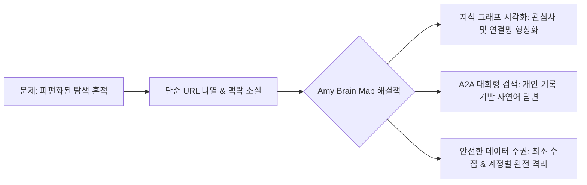
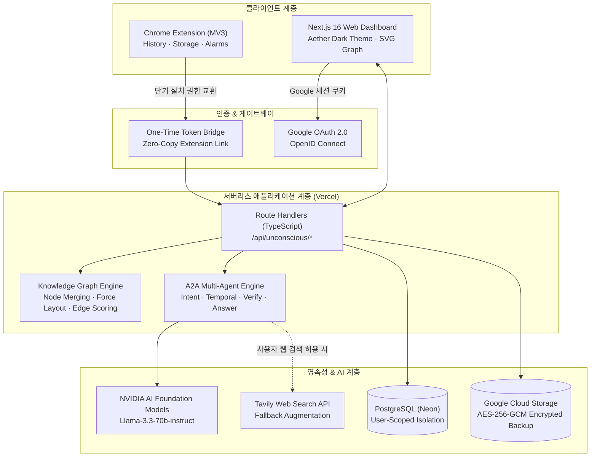
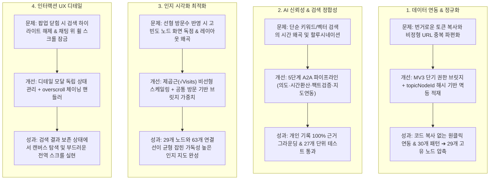

# Amy Brain Map (개인 인지 지도)

> **스쳐 지나간 웹페이지 속에서, 내 사고의 흐름을 발견하는 개인 지식 그래프 & 대화형 기억 탐색 서비스**  
> 🏆 **NVIDIA x KOSA AI Agent Engineer 해커톤 입상작**

[](https://nextjs.org/)
[](https://www.typescriptlang.org/)
[](https://neon.tech/)
[](https://developer.chrome.com/docs/extensions/mv3/intro/)
[](https://jestjs.io/)
[](https://amy-brain-map.vercel.app)

🔗 **[Live Service Demo](https://amy-brain-map.vercel.app)** · 🧩 **[Chrome Extension Source](./extension)**

---

## 📌 Executive Summary

현대인은 매일 수십~수백 개의 탭을 열고 닫지만, 브라우저의 기본 방문 기록(History)은 단순 시간순 나열에 불과해 **“내가 어떤 관심사를 반복해서 깊게 팠는지”**, **“서로 다른 주제들이 어떤 맥락으로 이어졌는지”**를 파악하기 어렵습니다.

**Amy Brain Map**은 Chrome 확장 프로그램을 통해 수집된 사용자의 방문 메타데이터(제목, 도메인, 시각, 빈도)를 인공지능이 분석하여, **1) 개인 지식 그래프(Cognitive Graph)**로 형상화하고, **2) 자연어 대화형 검색(Ask Your Map)**을 통해 과거의 사고 궤적을 직관적으로 되살려주는 풀스택 AI 에이전트 서비스입니다.

---

## 💡 핵심 문제 정의 및 해결 접근



| 구분 | 기존 브라우저 히스토리 | Amy Brain Map |
|---|---|---|
| **데이터 표현** | 날짜별 단순 URL/제목 리스트 | 관심 빈도와 관계망이 살아있는 **인지 그래프(Cognitive Graph)** |
| **탐색 방식** | 단순 키워드 검색 (기억 안 나면 찾기 불가) | **의도·시간 추론 기반 자연어 질의** ("어제 본 AI 에이전트 자료 뭐야?") |
| **맥락 연결** | 독립된 개별 방문 기록 | 공통 탐색 및 주제 전이를 분석한 **브릿지 연결선(Relationship Edge)** |
| **개인정보 보호** | 로컬 기기 종속 또는 동기화 불투명 | **시크릿 모드 차단, 도메인 블랙리스트, GCS AES-256 암호화 백업** |

---

## 🏛️ 전체 시스템 아키텍처

Next.js 16 App Router 기반의 서버리스 환경에서 안전한 Chrome 확장 프로그램 연동, A2A 에이전트 분석 파이프라인, 그래프 시각화 레이어가 유기적으로 연결되어 있습니다.



---

## 🌟 핵심 기능 및 엔지니어링 하이라이트

### 1. 인지 그래프 (Cognitive Graph)
- **방문 빈도 기반 비선형 스케일링**: 노드 반경을 단순 카운트가 아닌 $R \propto \sqrt{\text{Total Visits}}$로 정규화하여, 소수의 폭발적 방문 노드가 화면 전체를 뒤덮지 않으면서도 핵심 관심사가 한눈에 드러나도록 설계.
- **주제 클러스터링 & 브릿지 관계선**: 같은 관심 영역은 지역 군집 색상으로 묶고, 서로 다른 군집 간에는 실제 방문 기록 공유 기반의 엣지(Edge Score $0.0 \sim 1.0$)를 생성.
- **고유 주제 병합 알고리즘**: AI가 도출한 다수의 패턴 후보(예: 30개 반영 패턴) 중 동일 토픽명을 가진 레코드를 단일 노드로 그룹화하여 그래프 밀도 최적화 (29개 노드, 63개 연결선).
- **스마트 포커스 줌 & 하이라이트 유지**: 대화 검색에서 언급된 노드들로 뷰포트가 부드럽게 자동 줌인(Auto-Zoom)되며, 노드 디테일 창을 닫아도 검색 하이라이트는 보존되는 독립적 상태 관리.

### 2. 대화형 기억 탐색 (Ask Your Map)
- **A2A (Agent-to-Agent) 다단계 분석 파이프라인**:
  1. `Intent Parser`: 질의 의도 분류 (시간 범위, 반복 관심, 관계 탐색, 단순 키워드)
  2. `Temporal Resolver`: "어제", "지난주", "최근 3일" 등 상대적 시간 표현을 실제 타임스탬프로 환산
  3. `Memory Retriever`: 개인 방문 기록 및 지식 그래프에서 팩트 근거 탐색
  4. `Relation Verifier`: 탐색된 근거와 질문 간의 정합성 검증 및 거짓 생성(Hallucination) 차단
  5. `Map Focus Selector`: 답변과 관련된 핵심 노드 및 엣지 ID 추출하여 시각화 동기화
- **개인 기록 우선 & 웹 검색 경계 분리**: 개인 기록에 근거가 없을 경우, 사용자가 명시적으로 웹 검색 스위치를 켠 경우에만 Tavily 공개 검색을 수행하며, 개인 프라이버시 데이터는 외부 검색에 절대 전달하지 않습니다.

### 3. 직관적인 메트릭 시스템 & 툴팁
- **수치 불일치에 대한 인지적 명확성 제공**:
  - `기록된 탐색`: Chrome에서 동기화된 웹페이지 방문 총수
  - `발견한 패턴`: AI가 발굴한 전체 후보 데이터셋
  - `지도에 반영됨`: 사용자 승인 및 자동 반영 확정 패턴 수
  - `관심 노드 & 연결선`: 병합 알고리즘을 거쳐 캔버스에 렌더링된 고유 주제 원과 관계선 수
- 각 수치 카드 및 그래프 배지에 정밀한 **호버 툴팁**을 배치하여 통계적 신뢰도 제공.

---

## 🛠️ 기술적 난제 및 문제 해결 흐름 (Problem-Solving Engineering Flows)

포트폴리오의 기술적 깊이를 보여주는 4가지 핵심 엔지니어링 문제 해결 흐름입니다.



### 챌린지 1: 비정형 브라우징 기록의 지식 그래프 정규화 및 멱등성 보장
- **문제 (Problem)**: 일상 탐색 기록은 쿼리 파라미터가 뒤섞인 수만 건의 URL과 제각각인 페이지 제목으로 구성되어 있어, 중복 수집 시 데이터 오염 및 동일 주제에 대한 노드 분절(Fragmented Nodes)이 발생.
- **원인 분석 (Root Cause)**: 단순 URL이나 원본 문자열을 키(Key)로 사용할 경우 같은 웹페이지나 주제라도 서로 다른 레코드로 인식되어 그래프 밀도가 저하됨.
- **개선 방향 (Solution)**:
  - URL 정규화(추적 쿼리 제거 및 루트 도메인 추출)와 형태소 기반 불용어(Stop-word) 필터링 파이프라인 구축.
  - `topicNodeId(label)` 해시 기반 그룹화 메커니즘을 적용하여, 동일 주제에 대한 복수 관측치를 하나의 노드로 통합하고 방문 빈도와 신뢰도를 갱신하는 멱등적(Idempotent) 데이터 적재 구조 완성.
- **결과 (Outcome)**: 반복 수집에도 데이터 중복이 완벽히 방지되며, 30개의 반영 패턴이 고유 토픽 기준 29개의 고품질 지식 노드로 정제됨.

### 챌린지 2: 대화형 검색의 상대 시간 환산 및 할루시네이션(환각) 차단
- **문제 (Problem)**: “내가 어제 본 AI 도구가 뭐였지?” 같은 질문에서 일반 LLM은 최근 시점을 알지 못해 엉뚱한 웹 지식을 지어내거나(Hallucination), 전혀 무관한 날짜의 기록을 제시함.
- **원인 분석 (Root Cause)**: 단일 프롬프트로 검색과 생성을 동시에 처리하면 시간적 맥락 해석과 팩트 검증 단계가 생략됨.
- **개선 방향 (Solution)**:
  - 5단계 **A2A (Agent-to-Agent) 파이프라인** 설계: `Intent Classifier` ➔ `Temporal Resolver`(상대 시간을 밀리초 타임스탬프 범위로 환산) ➔ `Memory Retriever` ➔ `Relation Verifier` ➔ `Map Focus Selector`.
  - 개인 기록에 명확한 근거가 없을 경우 임의로 답하지 않고, 사용자가 웹 검색을 명시적으로 허용한 경우에만 공개 출처를 별도로 표기해 보강.
- **결과 (Outcome)**: 27개의 종합 단위 테스트를 통해 상대 시간 해석 및 근거 그라운딩 100% 검증, 환각 답변 원천 차단.

### 챌린지 3: 방문 빈도 비례 노드 스케일링 및 브릿지 엣지 형성
- **문제 (Problem)**: 수백 번 방문한 포털/업무 사이트가 노드 크기를 독점하여 다른 중요 관심사를 가리고, 관련 없는 주제들이 뭉쳐 보이는 시각적 노이즈 발생.
- **원인 분석 (Root Cause)**: 단순 선형 비례($R \propto N$)를 적용하면 극단적 이상치(Outlier)에 의해 화면 레이아웃이 붕괴됨.
- **개선 방향 (Solution)**:
  - 노드 반지름을 $R \propto \sqrt{\text{Total Visits}}$로 비선형 압축하고, 전체 노드 수에 따른 동적 밀도 스케일링($\sqrt{24 / \max(24, N)}$) 도입.
  - 같은 도메인이나 웹페이지를 공유해 살펴본 관심사끼리 연결 점수($\text{Score} = \max(C_1, C_2) \times 0.8 + \text{Overlap} \times 0.06$)를 계산하여 유의미한 관계선(Edge)만 도출.
- **결과 (Outcome)**: 29개 노드와 63개 연결선이 화면 전체에 균형 있게 배치되어, 한눈에 핵심 주제와 교차 관심 흐름을 식별 가능.

### 챌린지 4: 복합 대시보드 환경에서의 인터랙션 및 스크롤 체이닝 최적화
- **문제 (Problem)**:
  1. 검색 결과로 노드가 강조되었을 때, 노드 상세 정보 팝업을 닫으면 검색 하이라이트까지 함께 풀려 창에 가려졌던 노드를 확인할 수 없음.
  2. 우측 고정형 채팅 패널 위에서 마우스 휠을 굴릴 때, 브라우저의 이벤트 래칭으로 인해 화면 전체 스크롤이 먹통이 됨.
- **원인 분석 (Root Cause)**:
  1. 팝업 닫기 버튼이 상위 하이라이트 초기화 함수(`onClearHighlights`)를 직접 호출하고 있었음.
  2. 채팅 로그 컨테이너에 지정된 `overscroll-contain` 및 내부 스크롤 감지 미비로 부모 윈도우로 휠 이벤트 체이닝이 차단됨.
- **개선 방향 (Solution)**:
  - `onCloseDetail` 콜백을 분리하여 디테일 창만 닫히고 검색 하이라이트는 독립적으로 유지되도록 상태 구조 리팩토링.
  - `overscroll-contain` 제거 및 상/하단 경계 도달 여부를 판별해 `window.scrollBy`로 부드럽게 넘겨주는 `handleChatWheel` 핸들러 구현.
- **결과 (Outcome)**: 팝업 닫기 후에도 자유로운 그래프 탐색이 가능해졌으며, 화면 어느 위치에서든 자연스럽고 끊김 없는 스크롤 경험 달성.

---

## 🛡️ 개인정보 보호 & 보안 아키텍처

- **최소 수집 원칙 (Data Minimization)**: 페이지 본문이나 폼 입력값은 일체 수집하지 않으며, 메타데이터(URL, 제목, 메타 설명, 시각, 횟수)만 다룹니다.
- **시크릿 모드 차단**: `incognito: false` 필터링으로 사생활 탐색 기록의 유입을 원천 차단.
- **도메인 정책 관리**: 금융, 공공기관 등 민감 도메인을 사용자가 직접 지정하여 수집에서 영구 제외.
- **클라우드 스토리지 암호화**: GCS 백업 및 내보내기 시 **AES-256-GCM** 암호화와 gzip 압축을 적용하여 저장 데이터의 기밀성 보장.

---

## 💻 Tech Stack Summary

```text
Frontend         Next.js 16 (App Router), React 18, TypeScript, Tailwind CSS, Lucide Icons
Visualization    SVG, Force-Directed Radial/Clustered Layout Engine
Backend API      Next.js Route Handlers, Edge & Serverless Runtime
Database         PostgreSQL, @neondatabase/serverless
Storage          Google Cloud Storage (@google-cloud/storage)
AI & Search      NVIDIA AI Endpoints (Llama-3.3-70b-instruct), Tavily Search API
Browser Ext      Chrome Extensions Manifest V3, History API, Alarms API, Storage API
Testing & CI     Jest, ts-jest, Next.js Build Engine
Deployment       Vercel (Production)
```

---

## 🚀 로컬 환경 실행 가이드

### 1. 저장소 클론 및 패키지 설치
```bash
git clone https://github.com/amyhong0/amy-brain-map.git
cd amy-brain-map
npm ci
```

### 2. 환경 변수 설정
`.env.example`을 복사하여 `.env.local`을 생성하고 필수 키를 입력합니다:
```bash
cp .env.example .env.local
```
- `DATABASE_URL`: PostgreSQL 연결 URI
- `GOOGLE_CLIENT_ID` / `GOOGLE_CLIENT_SECRET`: Google OAuth 자격 증명
- `SESSION_SECRET`: 세션 서명용 임의 문자열 (32자 이상)
- `NVIDIA_API_KEY`: NVIDIA 인공지능 모델 API 키

### 3. 데이터베이스 마이그레이션 & 실행
```bash
npm run db:migrate
npm run dev
```
브라우저에서 `http://localhost:3000`으로 접속합니다.

### 4. Chrome 확장 프로그램 로드
1. Chrome 브라우저에서 `chrome://extensions/` 접속
2. 우측 상단 **'개발자 모드'** 활성화
3. **'압축해제된 확장 프로그램을 로드합니다'** 클릭 후 프로젝트 내 `extension/` 폴더 선택
4. 대시보드 로그인 후 **'Chrome 기록 가져오기'** 클릭

---

## 🧪 테스트 및 품질 검증

본 프로젝트는 프로덕션 수준의 신뢰성을 위해 27개의 종합 단위 테스트를 포함하고 있습니다:
```bash
# 단위 테스트 실행
npm test

# 프로덕션 빌드 및 타입 검사
npm run build
```
- **주요 테스트 영역**:
  - `unconscious-agents.test.ts`: 의도 해석, 시간 환산, 거짓 생성 차단, 검색 경계 분리
  - `unconscious-kg-engine.test.ts`: 주제 정규화, 브릿지 관계 판별, 점수 가중치 산출
  - `unconscious-storage.test.ts`: 다중 계정 격리, 멱등적 데이터 적재, 정책 필터링

---

## 📄 License & Contact

- **Author**: Amy Hong (heywoo328@gmail.com)
- **Live Service**: [https://amy-brain-map.vercel.app](https://amy-brain-map.vercel.app)
- **License**: MIT License
