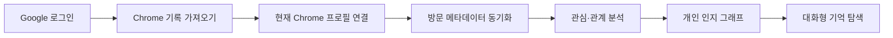
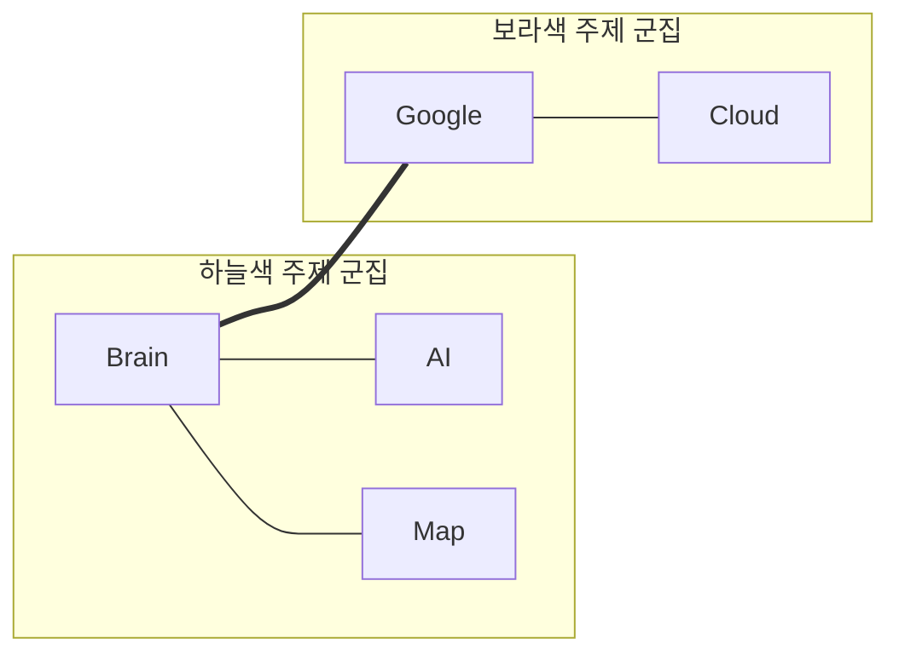
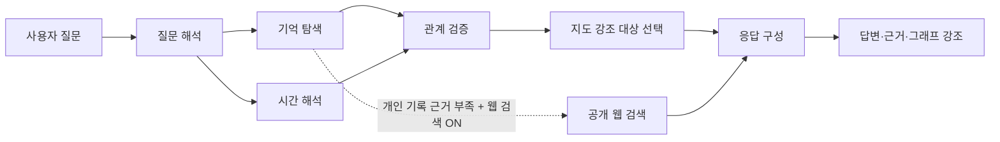
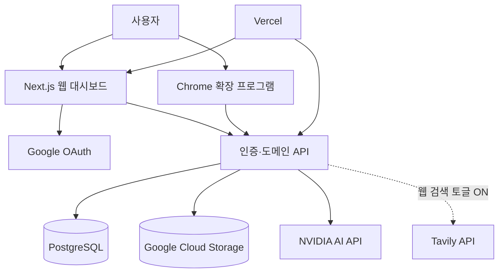

# Amy Brain Map

> **스쳐 지나간 웹페이지 속에서, 내 사고의 흐름을 발견하는 개인 인지 그래프 서비스**

[Live Demo](https://amy-brain-map.vercel.app) · [Chrome Extension](./extension) · [Operator Guide](./docs/operator-setup-guide.md)

Amy Brain Map은 Chrome 방문 기록에 남은 **제목·도메인·방문 시각·방문 횟수**를 분석해, 사용자가 무심코 반복해서 살펴본 주제와 주제 사이의 연결을 시각화하는 서비스입니다. 단순한 방문 목록을 넘어 “어제 본 AI 콘텐츠 제작 자료가 무엇이었지?”, “Nvidia와 연결된 다른 관심은 무엇이야?”와 같은 자연어 질문에 개인 기록을 근거로 답하고, 근거가 된 노드와 연결선을 지도에서 바로 확인할 수 있게 설계했습니다.

이 프로젝트는 **개인 데이터의 의미 있는 재해석**, **다중 사용자 데이터 격리**, **브라우저 확장 프로그램과 웹 서비스의 안전한 연동**을 하나의 제품 경험으로 구현한 풀스택 포트폴리오입니다.

## 프로젝트 한눈에 보기

| 구분 | 내용 |
|---|---|
| **문제** | 일상적인 웹 탐색은 빠르게 잊히지만, 반복 방문과 함께 본 페이지에는 관심사·학습 흐름·작업 맥락이 축적됩니다. |
| **해결** | 방문 메타데이터를 분석해 관심 노드와 연결 후보를 만들고, 대화형 검색과 그래프 탐색으로 다시 찾을 수 있게 합니다. |
| **사용자 가치** | 기억에 의존하지 않고, 자신의 관심이 어디서 반복되고 어떤 주제와 이어지는지 확인할 수 있습니다. |
| **개인정보 원칙** | 페이지 본문과 시크릿 모드 기록은 수집하지 않습니다. 사용자별 방문 메타데이터만 계정 단위로 분리해 보관합니다. |
| **배포 주소** | [amy-brain-map.vercel.app](https://amy-brain-map.vercel.app) |

## 사용자 흐름

사용자는 Google 계정으로 로그인한 뒤 **Chrome 기록 가져오기** 버튼을 누릅니다. 대시보드와 확장 프로그램은 짧은 수명의 설치 권한을 교환해 현재 Chrome 프로필을 연결하고, 방문 메타데이터를 초기 수집한 뒤 설정된 간격으로 증분 동기화합니다. 분석이 끝나면 서비스는 사용자의 탐색 흔적을 관심 그래프와 연결 검토 대상으로 제시합니다.



| 단계 | 사용자가 경험하는 기능 | 구현 포인트 |
|---|---|---|
| **1. 연결** | 별도 연결 코드 없이 Chrome 프로필을 연결합니다. | Google 세션으로 확인된 설치 권한을 확장 프로그램에 1회 전달합니다. |
| **2. 수집** | 최초 기록 수집의 진행률을 확인하고 이후 자동 수집 간격을 조절합니다. | Manifest V3 확장 프로그램이 History API와 Alarms API를 사용합니다.[1] |
| **3. 분석** | 반복 관심과 연결 후보를 검토·반영합니다. | 후보의 `pending`·`approved`·`rejected` 상태를 분리합니다. |
| **4. 탐색** | 그래프를 직접 탐색하거나 자연어로 자신의 기록을 검색합니다. | 질의 근거를 노드·연결선 강조 상태로 연결합니다. |

## 핵심 경험

### 1. 관심 그래프: 연결된 것은 가깝게, 다른 흐름은 구분되게

관심 그래프는 주제별로 색상을 달리하는 지역 군집을 만들되, 색상만으로 고립된 집단을 뜻하지는 않도록 설계했습니다. 실제 탐색 근거로 확인된 군집 간 연결은 **브리지 연결선**으로 남기고, 직접 연결된 노드와 군집은 엣지 인력 기반 레이아웃으로 서로 가까워지게 배치합니다.



| 그래프 기능 | 동작 |
|---|---|
| **군집별 색상** | 가까운 관련 주제를 동일 색상으로 묶어 지역적 맥락을 보여 줍니다. |
| **브리지 연결** | 서로 다른 색 군집 사이의 선은 실제 방문 근거가 확인된 교차 관심사입니다. |
| **연결 지향 배치** | 직접 연결된 노드의 가지 방향과 군집 위치를 서로 향하게 해 긴 연결선을 줄입니다. |
| **비중첩 처리** | 노드 반경과 연결 수를 고려해 충돌을 피하면서도 군집은 가까이 유지합니다. |
| **탐색 제어** | 휠·버튼 확대/축소, 빈 공간 드래그 이동, 키보드 방향 이동, 표시 설정을 제공합니다. |
| **호버 반응** | 노드 근처의 부드러운 반응은 유지하되, 노드 위에서는 움직임을 멈춰 안정적인 선택을 보장합니다. |
| **인라인 상세 정보** | 노드를 클릭하면 노드 옆 팝오버에서 상태·신뢰도·연결·근거를 확인하고 지도에서만 제거할 수 있습니다. |

> **그래프에서의 색상은 ‘가까운 주제 군집’을, 선은 ‘탐색 근거가 있는 관계’를 의미합니다.** 따라서 서로 다른 색의 노드 사이에 선이 존재할 수 있으며, 이는 관심 흐름이 만나는 지점을 보여 줍니다.

### 2. 대화형 기억 탐색: 개인 기록 우선, 공개 웹은 명시적 선택일 때만

질문은 키워드, 반복 관심, 연결, 최근 활동, 활동 시점의 다섯 가지 탐색 의도로 해석됩니다. 답변은 먼저 사용자의 방문 기록과 그래프 후보에서 근거를 찾고, 충분한 근거가 없으며 사용자가 **웹 검색** 토글을 켠 경우에만 Tavily를 통해 공개 정보를 보강합니다. 개인 방문 이력은 외부 검색 서비스에 전달하지 않습니다.

| 질의 예시 | 탐색 방식 | 결과 |
|---|---|---|
| “내가 어제 본 AI 콘텐츠 제작 자료가 뭐였지?” | 시간 범위 + 주제 기반 방문 기록 검색 | 관련 페이지, 도메인, 방문 횟수와 그래프 강조 |
| “Nvidia와 연결된 다른 관심은?” | 그래프 연결 탐색 | 직접 연결된 관심사와 공통 근거 확인 |
| “최근 일주일 동안 반복해서 본 주제는?” | 반복 방문·도메인·시간 흐름 분석 | 빈도와 맥락을 정리한 주제 요약 |
| “요즘 각광받는 에이전트 설계 방법” | 개인 기록 근거 부족 + 웹 검색 ON | 개인 기록과 구분된 공개 웹 출처 보강 |

## 역할 분리형 분석 파이프라인

Amy Brain Map은 개인 기록에 없는 내용을 기록에서 찾은 것처럼 답하지 않기 위해, 질의 해석·기억 탐색·시간 해석·관계 검증·지도 강조·응답 생성을 역할별로 분리했습니다. 이 구조는 단일 검색 결과를 바로 문장으로 변환하는 방식보다, **근거와 응답의 경계**를 명확하게 유지하는 데 초점을 둡니다.



## 아키텍처

Vercel은 웹 배포와 서버 API 실행 계층으로 사용하고, 사용자별 실시간 데이터는 PostgreSQL에, 암호화된 백업과 내보내기는 Google Cloud Storage에 저장합니다. 이를 통해 서버리스 실행 환경에서도 사용자 데이터와 백업 객체의 책임을 분리했습니다.



| 계층 | 기술 | 설계 의도 |
|---|---|---|
| **웹·API** | Next.js 16, App Router, TypeScript, Tailwind CSS | 하나의 코드베이스에서 대시보드와 서버 API를 구현합니다. |
| **인증** | Google OAuth 2.0, OpenID Connect, 서명 세션 쿠키 | Google 사용자 ID를 기준으로 데이터 접근 범위를 제한합니다. |
| **데이터** | PostgreSQL, Neon Serverless Driver | 방문 기록, 후보, 정책, 분석 실행을 계정 단위로 격리합니다. |
| **백업·내보내기** | Google Cloud Storage, AES-256-GCM, gzip | 사용자별 백업·내보내기 파일을 앱 수준 암호화 후 비공개 버킷에 보관합니다. |
| **Chrome 연동** | Manifest V3, History API, Storage API, Alarms API | 초기 수집·증분 동기화·자동 수집 간격을 브라우저 측에서 처리합니다.[1] |
| **AI·검색** | NVIDIA API, Tavily API | 개인 기록을 우선 탐색하고, 선택적으로 공개 정보를 보강합니다. |
| **배포** | Vercel | Next.js 애플리케이션과 API 라우트를 배포합니다. |

## 개인정보 및 안전 설계

개인 브라우징 기록을 다루는 제품인 만큼, 기능 구현과 함께 수집 범위·권한·데이터 경계를 우선 설계했습니다.

| 보호 항목 | 적용 방식 |
|---|---|
| **최소 수집** | URL, 제목, 마지막 방문 시각, 방문 횟수만 수집합니다. 페이지 본문과 시크릿 모드 기록은 수집하지 않습니다. |
| **계정별 격리** | 사용자, 방문 기록, 그래프 후보, 정책, 분석 실행을 Google 사용자 ID 기준으로 분리합니다. |
| **확장 프로그램 권한** | 사용자가 대시보드에서 기록 가져오기를 누를 때만 짧은 유효기간의 설치 권한을 발급합니다. |
| **API 접근 제어** | 웹 요청은 세션 쿠키로, 확장 프로그램 동기화 요청은 설치별 토큰으로 검증합니다. |
| **데이터 보호** | GCS 백업·내보내기에 AES-256-GCM 암호화와 gzip 압축을 적용합니다. |
| **사용자 통제** | 도메인 차단, 데이터 내보내기, 지도에서 항목 제거를 제공합니다. 지도 항목을 제거해도 근거 방문 기록은 삭제하지 않습니다. |

## 구현에서 집중한 문제

### 개인 기록을 ‘답변 가능한 근거’로 바꾸기

방문 기록은 제목과 URL만으로도 개인적인 맥락을 포함할 수 있습니다. 그래서 Amy Brain Map은 단순 키워드 일치만으로 답하지 않고, 방문 시간·반복 횟수·도메인·그래프 연결 후보를 함께 검토합니다. 특히 시간 표현을 실제 조회 범위로 해석하고, 개인 기록 근거가 없을 때 공개 웹 결과와 혼동되지 않게 분리했습니다.

### 보기 좋은 그래프보다 이해 가능한 그래프 만들기

초기 그래프는 노드가 겹치거나 같은 색의 군집이 떨어져 보이고, 연결선이 긴 문제가 있었습니다. 이를 해결하기 위해 연결 수를 반영한 노드 크기, 군집별 고유 색상, 충돌 회피, 직접 연결 노드 간 인력, 연결 방향 기반 가지 배치를 조합했습니다. 결과적으로 그래프는 단순 장식이 아니라 **어떤 관심이 왜 이어져 있는지 탐색하는 인터페이스**가 되었습니다.

### 서버리스 환경에서 다중 사용자 기록 다루기

웹 배포 계층과 사용자 데이터 저장 계층을 분리하고, 각 API 요청에서 로그인 사용자 범위를 확인하도록 구성했습니다. Chrome 확장 프로그램은 장기 공용 비밀값 대신 설치 단위 토큰을 사용하며, 자동 동기화는 사용자 설정 간격을 따릅니다.

## 기술 스택

| 영역 | 기술 |
|---|---|
| Language | TypeScript, JavaScript, SQL |
| Web | Next.js 16, React, App Router, Tailwind CSS |
| Visualization | SVG, 포스 기반 군집 레이아웃, CSS 인터랙션 |
| Data | PostgreSQL, Neon Serverless Driver, Google Cloud Storage |
| Authentication | Google OAuth 2.0, OpenID Connect, HTTP-only Session Cookie |
| Browser Extension | Chrome Extension Manifest V3, History API, Storage API, Alarms API |
| AI | NVIDIA API, Tavily API |
| Testing | Jest, ts-jest, Next.js Production Build |
| Deployment | Vercel |

## 로컬 실행

외부 서비스 설정이 필요한 프로젝트입니다. 데이터베이스, Google OAuth, GCS, AI API 관련 환경 변수는 [운영자 설정 가이드](./docs/operator-setup-guide.md)를 참고합니다.

```bash
npm ci
cp .env.example .env.local
npm run db:migrate
npm run dev
```

개발 환경의 Google OAuth Redirect URI에는 다음 주소를 등록합니다.

```text
http://localhost:3000/api/auth/callback
```

Chrome 확장 프로그램은 `chrome://extensions`에서 **개발자 모드**를 켠 뒤 `extension/` 디렉터리를 압축 해제하여 로드합니다. 대시보드에서 로그인한 후 **Chrome 기록 가져오기**를 누르면 현재 Chrome 프로필이 연결되고 동기화가 시작됩니다.

## 프로젝트 구조

```text
app/                               # Next.js 페이지와 인증·도메인 API
components/unconscious/            # 관심 그래프, 연결 검토, 타입 정의
extension/                         # Manifest V3 Chrome 확장 프로그램
lib/unconscious-agents.ts          # 역할 분리형 질의·분석 파이프라인
lib/unconscious-auth.ts            # OAuth 세션·확장 설치 권한 검증
lib/utils/unconscious-storage.ts   # 사용자별 PostgreSQL 저장소 계층
lib/gcs-archive.ts                 # 암호화된 GCS 백업·내보내기
db/migrations/                     # PostgreSQL 스키마 마이그레이션
docs/                              # 운영과 아키텍처 문서
```

## 검증

```bash
npm test -- --runInBand
npm run build
```

현재 단위 테스트는 개인 기록 우선 탐색, 반복 관심, 시간 기반 질의, 웹 검색 경계, 인증 페이지 제외, 한국어·영어 동의어 연결, 저장소 중복 방지 등을 검증합니다. 배포 전에는 Next.js TypeScript 프로덕션 빌드를 실행합니다.

## 운영 문서

| 문서 | 설명 |
|---|---|
| [운영자 설정 가이드](./docs/operator-setup-guide.md) | Google OAuth, PostgreSQL, GCS, 환경 변수 설정 |
| [다중 사용자 아키텍처 검토 메모](./docs/multi-user-feasibility-notes.md) | 계정 격리와 운영 구조 검토 |

## References

[1]: [Chrome for Developers — `chrome.history` API](https://developer.chrome.com/docs/extensions/reference/api/history) — Chrome 방문 기록 조회 API
