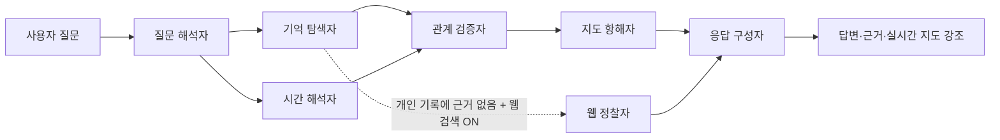

# Amy Brain Map — Personal Cognitive Atlas

Amy Brain Map은 **의식적으로 정리하지 못한 웹 탐색의 흔적을 반복 관심·시간적 흐름·잠재적 연결로 해석해, 나만의 사고 지도를 만드는 개인 브레인 맵**입니다. 이 버전은 수동 URL·파일 등록과 문서 유사도 그래프를 제거하고, Chrome 방문 기록 메타데이터와 다중 에이전트 협업을 중심으로 재설계되었습니다.

## 핵심 경험

단일 화면에서 질문을 입력하면 질문 해석자, 기억 탐색자, 시간 해석자, 관계 검증자, 지도 항해자, 응답 구성자가 순차적으로 협업합니다. 예를 들어 “내가 어제 본 것 중에 AI 콘텐츠 제작 관련된 게 뭐더라?”라고 물으면 시간 조건과 키워드를 해석하고, 관련 방문 흔적을 찾은 뒤, 교차 검증된 관심 축과 연결 가설만 지도에서 강조합니다.

| 기능 | 동작 | 개인정보 경계 |
|---|---|---|
| **Chrome 방문 기록 동기화** | 과거 기록을 한 번 수집한 뒤 새 방문을 증분 동기화합니다. | URL, 제목, 방문 시각, 방문 횟수만 전송합니다. 시크릿 모드와 본문은 수집하지 않습니다. |
| **무의식 체계 지도** | 반복 관심은 노드 크기, 탐색 흐름의 연결은 선, 질문 결과는 강조색으로 표시합니다. | 원문 페이지를 상시 보관하지 않습니다. |
| **발견 인박스** | 반복 관심과 시간적 인접성을 바탕으로 생성한 관계 가설을 승인·제외할 수 있습니다. | 자동 반영 전에는 항상 근거·신뢰도·도메인을 확인할 수 있습니다. |
| **에이전트 간 교차 검증** | 탐색 에이전트의 방문 근거 ID를 관계 검증 에이전트가 다시 확인한 뒤 지도 에이전트에 전달합니다. | AI 추론은 근거와 구분되어 ‘가설’로 표시됩니다. |
| **선택적 웹 검색** | 대화창의 **웹 검색** 토글을 켜고 개인 기록에서 직접 근거를 찾지 못했을 때만 공개 웹을 검색합니다. | 개인 방문 이력은 외부 검색 제공자에게 전송하지 않으며, 질문 문장만 검색합니다. |

## 빠른 시작

### 1. 앱 실행

Node.js 18 이상이 필요합니다.

```bash
npm ci
cp .env.example .env.local
npm run dev
```

개발 서버는 기본적으로 `http://localhost:3000`에서 실행됩니다.

### 2. 환경 변수 설정

아래 값은 개발용 `.env.local` 또는 배포 환경 변수에 설정합니다.

| 변수 | 필수 여부 | 설명 |
|---|---|---|
| `BROWSER_HISTORY_INGEST_TOKEN` | 필수 | 앱 대시보드와 Chrome 확장 프로그램을 연결하는 개인 보호 키입니다. 충분히 긴 무작위 값을 사용하세요. |
| `BROWSER_HISTORY_ENCRYPTION_KEY` | Vercel Blob 사용 시 필수 | Blob 저장소의 방문 기록 데이터를 AES-256-GCM으로 암호화하는 64자리 16진수 키입니다. |
| `NVIDIA_API_KEY` | 선택 | 대화 응답을 더 자연스럽게 구성합니다. 없으면 근거 기반 요약으로 동작합니다. |
| `TAVILY_API_KEY` | 선택 | 웹 검색 토글을 켰을 때 개인 기록에 없는 질문을 공개 웹 결과로 보강합니다. |

> `BROWSER_HISTORY_INGEST_TOKEN`과 `BROWSER_HISTORY_ENCRYPTION_KEY`는 절대 커밋하지 마세요. Vercel Blob 환경에서는 암호화 키가 없으면 방문 기록 저장을 거부하도록 구현되어 있습니다.

### 3. Chrome 확장 프로그램 설치

1. Chrome에서 `chrome://extensions`를 엽니다.
2. **개발자 모드**를 켭니다.
3. **압축해제된 확장 프로그램을 로드합니다**를 선택하고 이 저장소의 `extension/` 폴더를 고릅니다.
4. 설치된 확장 프로그램의 **연결·개인정보 설정**을 열고 앱 주소와 `BROWSER_HISTORY_INGEST_TOKEN` 값을 입력합니다.
5. 동기화를 켠 뒤 확장 프로그램 팝업에서 **지난 365일 기록 가져오기**를 한 번 실행합니다.

확장 프로그램은 Manifest V3 및 `history`, `storage`, `alarms` 권한만 사용합니다. `history` 권한은 Chrome 방문 기록 API에 필요합니다.[^chrome-history]

## 에이전트 협업 흐름



웹 정찰자는 사용자가 대화창에서 웹 검색 토글을 켠 경우에만, 그리고 개인 방문 기록에서 관련 근거를 찾지 못한 경우에만 호출됩니다. 웹 검색 결과는 개인 기록과 분리해 **웹 보강** 표시 및 출처 링크로 보여 줍니다.

## API 개요

모든 방문 기록 관련 API는 `x-brain-history-token` 헤더로 보호됩니다.

| 경로 | 역할 |
|---|---|
| `POST /api/unconscious/visits` | Chrome 확장 프로그램이 방문 메타데이터 배치를 중복 없이 동기화합니다. |
| `GET/PATCH /api/unconscious/settings` | 보존 기간, 분석 빈도, 도메인 차단·허용 정책을 제어합니다. |
| `POST /api/unconscious/analyze` | 새 방문 메타데이터에서 반복 관심 및 연결 가설을 생성합니다. |
| `GET /api/unconscious/analyze` | 발견 후보와 최근 분석 실행 이력을 반환합니다. |
| `PATCH /api/unconscious/candidates/:id` | 후보를 승인하거나 제외합니다. 승인된 후보는 지도용 지식 문서로 보존됩니다. |
| `POST /api/unconscious/query` | 다중 에이전트가 질문을 처리하고, 지도 강조 대상·근거 방문·선택적 웹 출처를 반환합니다. |

## 검증

```bash
npm run build
```

프로덕션 빌드는 TypeScript 검사와 Next.js 최적화 빌드를 함께 수행합니다.

## 참고

[^chrome-history]: [Chrome for Developers — chrome.history API](https://developer.chrome.com/docs/extensions/reference/api/history)
