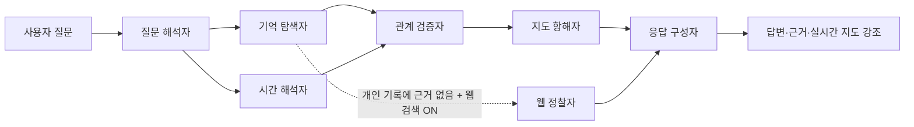

# Amy Brain Map — Personal Cognitive Atlas

Amy Brain Map은 **무심코 지나친 웹 탐색의 흔적을 반복 관심·시간적 흐름·잠재적 연결로 해석해, 개인의 사고 지도를 만드는 서비스**입니다. 수동 URL·파일 등록과 문서 유사도 그래프를 제거하고 Chrome 방문 기록 메타데이터와 다중 에이전트 협업을 중심으로 설계했습니다.

## 다중 사용자 아키텍처

| 구성 요소 | 사용 서비스 | 역할 |
|---|---|---|
| 웹 앱·서버 API | Vercel | Next.js 배포, Google OAuth 콜백, 인증된 API 실행 |
| 사용자별 실시간 데이터 | 관리형 PostgreSQL | 사용자, 세션, Chrome 확장 설치, 방문 메타데이터, 지도 후보, 개인정보 정책 |
| 백업·내보내기 | Google Cloud Storage | 사용자별 암호화 원본 백업, 사용자가 요청한 내보내기, 장기 분석 산출물 |
| 사용자 인증 | Google OAuth / OpenID Connect | Google `sub` 기반 영구 사용자 식별과 서버 세션 쿠키 |

Vercel은 **배포와 서버 API 실행만** 담당합니다. 방문 기록과 그래프는 PostgreSQL에 행 단위로 저장되고, GCS에는 AES-256-GCM으로 한 번 더 암호화한 압축 백업·내보내기 파일만 저장됩니다.

## 개인정보 보호 원칙

| 항목 | 처리 방식 |
|---|---|
| 수집 범위 | URL, 제목, 방문 시각, 방문 횟수만 수집합니다. |
| 미수집 범위 | 페이지 본문, 시크릿 모드 방문, Chrome 동기화 계정 비밀번호는 수집하지 않습니다. |
| 사용자 격리 | 모든 방문·후보·정책·분석 실행은 Google 사용자 ID로 분리합니다. |
| 확장 프로그램 권한 | 서버 공용 비밀값을 사용하지 않습니다. 로그인 사용자가 발급한 10분짜리 단회 연결 코드를 설치 전용 토큰으로 교환합니다. |
| 백업·내보내기 | GCS 비공개 버킷에 저장하고, 앱 수준 AES-256-GCM 암호화와 GCS 기본 서버 측 암호화를 함께 적용합니다. |

## 핵심 경험

단일 화면에서 질문을 입력하면 질문 해석자, 기억 탐색자, 시간 해석자, 관계 검증자, 지도 항해자, 응답 구성자가 협업합니다. 예를 들어 “내가 어제 본 것 중에 AI 콘텐츠 제작 관련된 게 뭐더라?”라고 물으면 시간 조건과 키워드를 해석하고, 관련 방문 흔적을 찾은 뒤, 교차 검증된 관심 축과 연결 가설만 지도에서 강조합니다.

| 기능 | 동작 |
|---|---|
| **Chrome 방문 기록 동기화** | 과거 기록을 한 번 읽은 뒤 새 방문을 증분 동기화합니다. 초기 수집은 최대 100,000건을 500건 단위로 순차 처리합니다. |
| **무의식 체계 지도** | 반복 관심은 노드 크기, 탐색 흐름의 연결은 선, 질문 결과는 강조색으로 표시합니다. |
| **발견 인박스** | 반복 관심과 시간적 인접성을 바탕으로 생성한 관계 가설을 승인·제외할 수 있습니다. |
| **에이전트 간 교차 검증** | 탐색 에이전트의 방문 근거 ID를 관계 검증 에이전트가 다시 확인한 뒤 지도 에이전트에 전달합니다. |
| **선택적 웹 검색** | 사용자가 웹 검색 토글을 켜고 개인 기록에 직접 근거가 없을 때만 공개 웹을 검색합니다. 질문 문장만 검색하며 방문 이력은 외부 검색에 전송하지 않습니다. |
| **내 기록 내보내기** | 사용자가 요청하면 계정 범위의 암호화 내보내기를 GCS에 생성하고 세션으로 검증된 다운로드 경로만 제공합니다. |

## 운영자 준비 절차

배포 전에 **[운영자 설정 가이드](docs/operator-setup-guide.md)**를 완료하십시오. 이 가이드는 Neon PostgreSQL, GCS 비공개 버킷·서비스 계정, Google OAuth 웹 클라이언트, Vercel Production 환경 변수 설정을 단계별로 설명합니다.

> 서비스 사용자는 PostgreSQL·GCS·Vercel 비밀값을 알거나 입력할 필요가 없습니다. 사용자는 Google 로그인과 Chrome 확장 프로그램 연결 코드만 사용합니다.

### 1. 환경 변수 설정

`.env.example`을 참고하여 개발 환경이나 Vercel Production Environment에 환경 변수를 설정합니다.

| 변수 | 필수 | 역할 |
|---|---:|---|
| `DATABASE_URL` | 예 | 관리형 PostgreSQL의 pooled 연결 문자열 |
| `GOOGLE_CLIENT_ID` / `GOOGLE_CLIENT_SECRET` | 예 | Google OAuth 웹 클라이언트 자격 증명 |
| `NEXT_PUBLIC_APP_URL` | 예 | 실제 배포 URL. OAuth 콜백 URI 기준이 됩니다. |
| `AUTH_SESSION_SECRET` | 예 | 32자 이상 고유한 세션 상태·쿠키 보호 비밀값 |
| `GCS_BUCKET_NAME` | 예 | 비공개 GCS 버킷 이름 |
| `GCS_SERVICE_ACCOUNT_JSON` | 예 | 버킷 최소 권한 서비스 계정 JSON 키 전체 내용 |
| `HISTORY_BACKUP_ENCRYPTION_KEY` | 예 | GCS 백업·내보내기용 AES-256-GCM 키 |
| `NVIDIA_API_KEY` | 예 | AI 대화 응답 구성 |
| `TAVILY_API_KEY` | 선택 | 웹 검색 토글을 사용할 때만 필요 |

이전 단일 사용자 구조의 `BROWSER_HISTORY_INGEST_TOKEN`, `BROWSER_HISTORY_ENCRYPTION_KEY`, `BLOB_READ_WRITE_TOKEN`은 더 이상 사용하지 않습니다.

### 2. PostgreSQL 스키마 적용

`DATABASE_URL`을 설정한 뒤 한 번 실행합니다.

```bash
npm ci
npm run db:migrate
```

### 3. 앱 실행

```bash
npm run dev
```

개발 서버는 기본적으로 `http://localhost:3000`에서 실행됩니다. 개발용 OAuth 클라이언트에는 `http://localhost:3000/api/auth/callback`을 Redirect URI로 추가해야 합니다.

## Chrome 확장 프로그램 설치와 연결

1. Chrome에서 `chrome://extensions`를 엽니다.
2. **개발자 모드**를 켭니다.
3. **압축해제된 확장 프로그램을 로드합니다**를 선택하고 이 저장소의 `extension/` 폴더를 고릅니다.
4. Amy Brain Map 웹 화면에서 Google로 로그인합니다.
5. 아직 기록이 없으면 표시되는 **연결 코드 발급**을 누릅니다.
6. 확장 프로그램의 **연결 설정**에서 앱 주소와 `ABM-...` 형식 연결 코드를 입력하고 동기화를 켭니다.
7. 코드가 확인되면 웹 화면으로 돌아와 **Chrome 기록 가져오기**를 누릅니다.

연결 코드는 단회·10분 유효이며, 확인 뒤 확장 프로그램은 해당 Chrome 프로필에만 연결된 설치 전용 토큰을 저장합니다. 다른 사용자와 코드를 공유하거나 운영자 비밀값을 확장 프로그램에 넣을 필요가 없습니다.

확장 프로그램은 Manifest V3 및 `history`, `storage`, `alarms`, `scripting` 권한을 사용합니다. `history` 권한은 Chrome 방문 기록 API에, `scripting` 권한은 사용자가 웹 화면에서 누른 전체 기록 동기화 요청을 확장 프로그램에 전달하는 데 필요합니다.[^chrome-history]

## 에이전트 협업 흐름



웹 정찰자는 사용자가 대화창에서 웹 검색 토글을 켠 경우에만, 그리고 개인 방문 기록에서 관련 근거를 찾지 못한 경우에만 호출됩니다. 웹 검색 결과는 개인 기록과 분리해 **웹 검색** 표시 및 출처 링크로 보여 줍니다.

## API 개요

| 경로 | 인증·역할 |
|---|---|
| `GET /api/auth` | 현재 Google 로그인 세션 조회 |
| `GET /api/auth/login` / `GET /api/auth/callback` | OAuth 로그인 시작·콜백 |
| `POST /api/auth` | 로그아웃 |
| `POST /api/unconscious/extension/connect-code` | 로그인 사용자가 단회 연결 코드 발급 |
| `POST /api/unconscious/extension/connect` | 확장 프로그램이 코드를 설치 전용 토큰으로 교환 |
| `POST /api/unconscious/visits` | 설치 전용 토큰으로 방문 메타데이터 배치 동기화 |
| `GET /api/unconscious/visits` | 로그인 사용자의 최근 방문 메타데이터 조회 |
| `GET/PATCH /api/unconscious/settings` | 로그인 사용자의 보존 기간·도메인 차단 정책 제어 |
| `POST/GET /api/unconscious/analyze` | 사용자별 발견 후보 생성·조회 |
| `PATCH /api/unconscious/candidates/:id` | 사용자 자신의 후보 승인·제외 |
| `POST /api/unconscious/query` | 사용자별 다중 에이전트 질의와 지도 강조 |
| `POST /api/unconscious/archives` | GCS에 암호화 백업·내보내기 생성 |
| `GET /api/unconscious/archives/:id` | 소유자 세션으로 내보내기 다운로드 |

## 검증

```bash
npm test
npm run build
```

프로덕션 빌드는 TypeScript 검사와 Next.js 최적화 빌드를 함께 수행합니다.

## 참고

[^chrome-history]: [Chrome for Developers — chrome.history API](https://developer.chrome.com/docs/extensions/reference/api/history)
