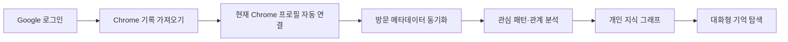
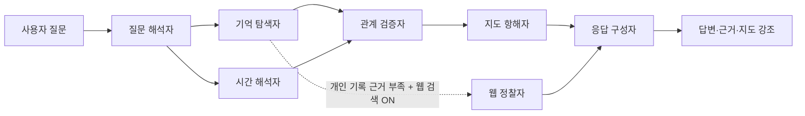
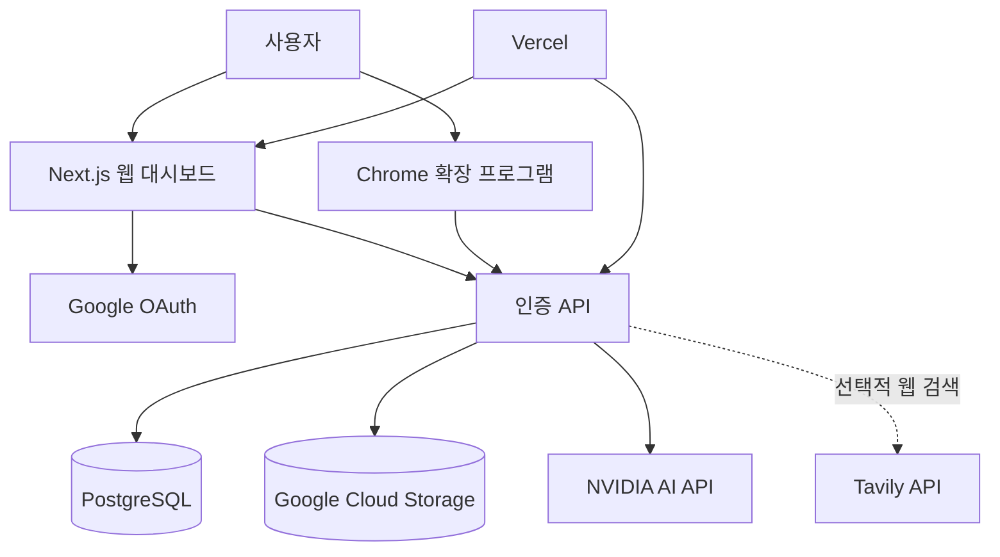

# Amy Brain Map

> **매일의 탐색에 쌓인 관심의 패턴을 분석해, 나만의 무의식 지도를 만드는 개인 지식 그래프 서비스**

Amy Brain Map은 Chrome 방문 기록에 남은 탐색 신호를 읽고, 반복적으로 관심을 둔 주제와 시간에 따른 탐색 흐름을 **대화 가능한 지식 그래프**로 바꾸는 서비스입니다. 사용자는 단순히 “내가 어제 본 AI 콘텐츠 제작 자료가 뭐였지?”라고 물어볼 수 있고, 서비스는 개인 기록을 근거로 답변하며 관련 관심 축과 연결을 지도 위에 강조합니다.

이 프로젝트는 **개인 데이터의 의미 있는 재해석**과 **다중 사용자 서비스 운영에 필요한 보안·저장소 설계**를 함께 다룬 풀스택 프로젝트입니다.

## 프로젝트 한눈에 보기

| 구분 | 내용 |
|---|---|
| **문제** | 일상적인 웹 탐색은 빠르게 사라지지만, 그 안에는 반복 관심과 학습 방향을 보여 주는 신호가 축적됩니다. |
| **해결 방식** | Chrome 방문 기록의 URL·제목·시각·횟수를 분석해 관심 축과 관계 가설을 만들고, 그래프와 대화형 질의로 다시 탐색합니다. |
| **핵심 가치** | 기억에 의존하지 않고도 자신의 탐색 패턴을 발견하고, 개인의 관심사·학습 흐름·맥락을 다시 찾아볼 수 있습니다. |
| **개인정보 원칙** | 페이지 본문은 수집하지 않으며, 방문 메타데이터만 사용자 계정별로 분리해 저장합니다. |

## 사용자 경험

사용자는 Google 계정으로 로그인한 뒤 **Chrome 기록 가져오기** 버튼을 한 번 누릅니다. 대시보드와 확장 프로그램은 이 순간에만 내부 단기 권한을 교환해 현재 Chrome 프로필을 자동 연결하고, 방문 기록을 초기 일괄 수집한 뒤 증분 동기화합니다. 대시보드와 팝업은 동기화 진행률과 분석 결과를 한 화면에서 제공합니다.



| 경험 | 구현 방식 |
|---|---|
| **기록 연결** | Chrome 확장 프로그램이 최대 100,000건의 초기 방문 기록을 500건씩 순차 동기화하고, 진행률을 화면에 표시합니다. |
| **무의식 지도** | 반복적으로 방문한 주제는 관심 축으로 시각화하고, 시간·도메인·탐색 패턴에 근거한 관계 가설을 연결선으로 보여 줍니다. |
| **기억 탐색** | 자연어 질문을 시간 조건과 주제로 해석해, 근거 방문 기록과 관계 가설을 함께 찾습니다. |
| **발견 검토** | 사용자는 생성된 관계 가설을 승인하거나 제외해 자신의 지도를 직접 다듬을 수 있습니다. |
| **웹 검색 보강** | 사용자가 명시적으로 켠 경우에만 개인 기록에 없는 정보를 공개 웹 검색으로 보강하며, 방문 이력은 검색 서비스로 전송하지 않습니다. |
| **데이터 주권** | 사용자는 자신의 기록을 암호화된 내보내기 파일로 받을 수 있습니다. |

## 멀티 에이전트 기억 탐색

질문에 대한 응답은 하나의 모델 호출이 아니라, 역할이 분리된 에이전트가 근거를 교차 검증하는 파이프라인을 거칩니다. 이 구조는 답변을 자연스럽게 만드는 것뿐 아니라, 개인 기록에 없는 내용을 마치 기록에서 찾은 것처럼 제시하지 않도록 설계한 장치입니다.



| 에이전트 | 역할 |
|---|---|
| **질문 해석자** | 질문에서 주제, 시간 범위, 탐색 의도를 추출합니다. |
| **기억 탐색자** | 사용자 자신의 방문 기록에서 관련 URL·제목·도메인 신호를 찾습니다. |
| **시간 해석자** | “어제”, “최근 일주일”과 같은 시간 표현을 실제 조회 범위로 변환합니다. |
| **관계 검증자** | 후보 연결이 실제 방문 근거와 일치하는지 재검증합니다. |
| **지도 항해자** | 질문과 가장 관련 있는 노드·관계를 선택해 그래프 강조 상태를 만듭니다. |
| **응답 구성자** | 개인 기록 근거와 선택적 웹 검색 결과를 분리해 답변을 구성합니다. |

## 아키텍처

서비스는 **Vercel을 배포와 서버 API 실행 계층으로만** 사용합니다. 사용자별 실시간 데이터는 PostgreSQL에, 백업과 내보내기는 비공개 Google Cloud Storage에 저장해 쓰기·조회·백업의 성격을 분리했습니다.



| 계층 | 기술 | 설계 의도 |
|---|---|---|
| **프론트엔드·API** | Next.js 16, App Router, TypeScript, Tailwind CSS | 단일 대시보드 경험과 서버 API를 같은 코드베이스에서 구현합니다. |
| **인증** | Google OAuth 2.0 / OpenID Connect, 서명 세션 쿠키 | Google `sub`를 사용자 영구 식별자로 사용하고, 웹 API 요청을 사용자 범위로 제한합니다. |
| **실시간 데이터** | PostgreSQL, Neon Serverless Driver | 방문 기록·도메인 정책·분석 실행·그래프 후보를 행 단위로 저장하고 계정별로 격리합니다. |
| **백업·내보내기** | Google Cloud Storage | AES-256-GCM 암호화와 gzip 압축을 적용한 사용자별 백업·내보내기 객체를 비공개 버킷에 보관합니다. |
| **Chrome 연동** | Manifest V3, History API, Alarms API | 방문 신호 수집과 증분 동기화를 브라우저 측에서 수행합니다.[^chrome-history] |
| **AI·검색** | NVIDIA API, Tavily API | 개인 기록 기반 답변을 우선하고, 사용자 동의가 있을 때만 공개 웹을 보강합니다. |

## 보안 및 개인정보 설계

개인 브라우징 기록을 다루는 만큼, 기능보다 먼저 **수집 범위·권한·격리 경계**를 설계했습니다.

| 보호 항목 | 적용 방식 |
|---|---|
| **최소 수집** | URL, 제목, 마지막 방문 시각, 방문 횟수만 수집합니다. 페이지 본문과 시크릿 모드 방문은 수집하지 않습니다. |
| **사용자 격리** | 사용자, 방문 기록, 그래프 후보, 개인정보 정책, 분석 실행은 모두 Google 사용자 ID를 기준으로 분리합니다. |
| **확장 프로그램 권한** | 사용자가 코드를 입력하지 않아도, 로그인된 대시보드가 내부 단기 권한을 단 한 번 교환해 설치 전용 토큰을 발급합니다. |
| **API 접근 제어** | 웹 요청은 세션 쿠키로, 확장 프로그램 동기화 요청은 설치 전용 토큰으로 각각 검증합니다. |
| **저장 데이터 보호** | GCS 백업·내보내기는 앱 수준 AES-256-GCM 암호화와 GCS의 기본 서버 측 암호화를 함께 사용합니다. |
| **사용자 통제** | 도메인 차단 정책과 사용자 요청 기반의 데이터 내보내기 기능을 제공합니다. |

## 구현에서 집중한 지점

### 1. 데이터의 의미를 만드는 분석 흐름

방문 기록을 단순 목록으로 보여 주는 대신, 반복 방문·도메인·시간 인접성·제목 키워드를 결합해 그래프 후보를 생성합니다. 생성된 후보는 자동 반영과 사용자 검토 상태를 구분해, AI의 추론을 확정된 사실처럼 다루지 않도록 했습니다.

### 2. 서버리스 환경에 맞춘 다중 사용자 저장소

Vercel 서버리스 실행 환경에서 동시성·조회 성능·사용자 격리를 고려해 PostgreSQL을 실시간 데이터베이스로 선택했습니다. 연결 문자열은 서버 환경 변수로만 관리하고, 마이그레이션으로 사용자·세션·설치 권한·방문 기록·정책·분석 실행 테이블을 명시적으로 관리합니다.

### 3. 확장 프로그램과 웹 서비스 간의 안전한 연결

Chrome 확장 프로그램은 장기간 재사용 가능한 서버 공용 키를 보관하지 않습니다. 사용자가 대시보드에서 Chrome 기록 가져오기를 누를 때 로그인 세션으로 확인된 짧은 유효기간의 내부 권한을 한 번만 교환해 설치 토큰을 만들며, 이후 동기화는 해당 설치와 사용자 범위 안에서만 처리됩니다.

### 4. 개인 기록과 공개 웹 정보의 경계

웹 검색 토글을 켜도 개인 방문 이력은 외부 검색 서비스에 보내지 않습니다. 개인 기록에서 근거가 확인되는 경우 해당 기록을 우선하고, 부족한 경우에만 질문 문장을 사용해 공개 웹 검색을 수행하며 결과를 별도로 표시합니다.

## 기술 스택

| 영역 | 기술 |
|---|---|
| Language | TypeScript, JavaScript, SQL |
| Web | Next.js 16, React, App Router, Tailwind CSS |
| Data | PostgreSQL, Neon Serverless Driver, Google Cloud Storage |
| Authentication | Google OAuth 2.0, OpenID Connect, HTTP-only session cookie |
| Browser Extension | Chrome Extension Manifest V3, History API, Storage API, Alarms API |
| AI | NVIDIA API, Tavily API |
| Testing | Jest, ts-jest, Next.js production build |
| Deployment | Vercel |

## 로컬 실행

외부 서비스 설정이 필요한 프로젝트입니다. 운영 환경 설정은 [운영자 설정 가이드](docs/operator-setup-guide.md)를 참고합니다.

```bash
npm ci
cp .env.example .env.local
npm run db:migrate
npm run dev
```

개발 환경에서는 Google OAuth 클라이언트의 Redirect URI에 다음 주소를 등록합니다.

```text
http://localhost:3000/api/auth/callback
```

Chrome 확장 프로그램은 `chrome://extensions`에서 **개발자 모드**를 켠 뒤, `extension/` 디렉터리를 압축 해제하여 로드할 수 있습니다. 이후 웹 대시보드에 로그인해 **Chrome 기록 가져오기**를 누르면 현재 Chrome 프로필이 자동으로 연결되고 기록 동기화가 시작됩니다.

## 프로젝트 구조

```text
app/                         # Next.js 페이지와 인증·도메인 API
components/unconscious/      # 지식 그래프 시각화 컴포넌트
extension/                   # Manifest V3 Chrome 확장 프로그램
db/migrations/               # PostgreSQL 스키마 마이그레이션
lib/unconscious-agents.ts    # 역할 기반 다중 에이전트 파이프라인
lib/unconscious-auth.ts      # OAuth 세션·확장 설치 권한 검증
lib/utils/unconscious-storage.ts
                             # 사용자별 PostgreSQL 저장소 계층
lib/gcs-archive.ts           # 암호화 GCS 백업·내보내기
```

## 검증

```bash
npm test
npm run build
```

현재 검증 범위는 지식 그래프 분석·암호화 키 처리 단위 테스트와 Next.js TypeScript 프로덕션 빌드입니다.

## 운영 문서

- [운영자 설정 가이드](docs/operator-setup-guide.md)
- [다중 사용자 아키텍처 검토 메모](docs/multi-user-feasibility-notes.md)

[^chrome-history]: [Chrome for Developers — `chrome.history` API](https://developer.chrome.com/docs/extensions/reference/api/history)
